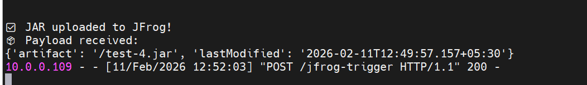

# JFrog JAR Upload API Trigger – End-to-End Documentation

---

## 📌 Overview

This document explains the complete flow to:

* Detect when a **JAR file is uploaded** to a JFrog repository
* Trigger a **Jenkins pipeline**
* Send a **POST API request** to a Linux server
* Process the payload using a Python Flask application

---

# 1️⃣ Listing JFrog Repositories

## List All Repositories for a User

```bash
curl -u Aravind:Eminds@1 "http://10.0.0.100:8082/artifactory/api/repositories"
```

### Sample Response

```json
[
  {
    "key": "autox-cucumber-testcase",
    "type": "LOCAL",
    "url": "http://10.0.0.100:8082/artifactory/autox-cucumber-testcase",
    "packageType": "Maven"
  }
]
```

---

# 2️⃣ List Artifacts Inside a Repository Path

```bash
curl -u Aravind:Eminds@1 \
"http://10.0.0.100:8082/artifactory/api/storage/autox-cucumber-testcase/com/example/autox/0.0.1-SNAPSHOT"
```

### Sample Response

```json
{
  "repo": "autox-cucumber-testcase",
  "path": "/com/example/autox/0.0.1-SNAPSHOT",
  "created": "2026-02-10T22:39:54.967+05:30",
  "createdBy": "aravind",
  "lastModified": "2026-02-10T22:39:54.967+05:30",
  "modifiedBy": "aravind",
  "lastUpdated": "2026-02-10T22:39:54.967+05:30",
  "children": [
    {
      "uri": "/autox-0.0.1-20260210.170945-1.jar",
      "folder": false
    }
  ],
  "uri": "http://10.0.0.100:8082/artifactory/api/storage/autox-cucumber-testcase/com/example/autox/0.0.1-SNAPSHOT"
}
```

---

# 3️⃣ Manual API Testing (Linux Server – 10.0.0.108)

## Location

```bash
/home/eminds/jfrog
```

---

## Flask API Script (jfrog_api.py)

```python
from flask import Flask, request

app = Flask(__name__)

@app.route("/jfrog-trigger", methods=["POST"])
def jfrog_trigger():
    print("✅ JAR uploaded to JFrog!")
    print("📦 Payload received:")
    print(request.json)
    return "OK", 200

app.run(host="0.0.0.0", port=5000)
```

### Run the API Manually

```bash
python3 jfrog_api.py
```

---

## Test the API Using Curl

```bash
curl -X POST http://10.0.0.108:5000/jfrog-trigger \
-H "Content-Type: application/json" \
-d '{"artifact":"test.jar"}'
```

---

# 4️⃣ Complete End-to-End Flow

## Architecture Flow

```
JFrog Upload 
     ↓
Jenkins Polling (Every 2 Minutes)
     ↓
Detect New or Updated JAR
     ↓
Send POST Request to API
     ↓
Flask Receives and Logs Payload
```

---

# 5️⃣ Jenkins Configuration (10.0.0.100)

## Create Pipeline Job

```
New Item → JFrog-Artifact-Trigger → Pipeline
```

---

## Enable Polling

Go to:

```
Build Triggers → Build Periodically
```

Use cron expression:

```bash
H/2 * * * *
```

✔ Polls every 2 minutes

---

# 6️⃣ Jenkins Pipeline Script

```groovy
node('em-docker-agent') {

    stage('Check JFrog Artifact') {

        sh '''
#!/bin/bash

ART_USER="aravind"
ART_PASS="Eminds@1"
BASE_URL="http://10.0.0.100:8082/artifactory"
REPO_PATH="autox-cucumber-testcase/com/example/autox/0.0.1-SNAPSHOT"
FOLDER_URL="$BASE_URL/api/storage/$REPO_PATH"
STATE_FILE="$HOME/.last_artifact.txt"

# Create state file if not exists
touch "$STATE_FILE"

echo "Checking for uploads..."

FILES=$(curl -s -u $ART_USER:$ART_PASS "$FOLDER_URL" | \
    jq -r '.children[] | select(.folder==false) | .uri')

NEW_ARTIFACT_DETECTED=0

for FILE_URI in $FILES; do

    FILE_URL="$BASE_URL/api/storage/$REPO_PATH${FILE_URI}"

    RESPONSE=$(curl -s -u $ART_USER:$ART_PASS "$FILE_URL")

    LAST_MODIFIED=$(echo "$RESPONSE" | jq -r '.lastModified')

    FILE_INFO="${FILE_URI}|${LAST_MODIFIED}"

    if ! grep -qx "$FILE_INFO" "$STATE_FILE"; then

        echo "🔥 Upload detected: $FILE_URI"
        echo "$FILE_INFO" >> "$STATE_FILE"
        NEW_ARTIFACT_DETECTED=1

        JSON=$(jq -n \
            --arg artifact "$FILE_URI" \
            --arg lastModified "$LAST_MODIFIED" \
            '{artifact: $artifact, lastModified: $lastModified}')

        echo "📦 Sending Payload: $JSON"

        HTTP_CODE=$(curl -s -o /dev/null -w "%{http_code}" \
            -X POST http://10.0.0.108:5000/jfrog-trigger \
            -H "Content-Type: application/json" \
            -d "$JSON")

        echo "Webhook response: $HTTP_CODE"
    fi

done

if [ "$NEW_ARTIFACT_DETECTED" -eq 0 ]; then
    echo "No new uploads."
fi
'''
    }
}
```

---

# 7️⃣ Why jq Is Required

The script parses JSON responses from JFrog API using `jq`.

Install on Jenkins node:

```bash
sudo apt update -y
sudo apt-get install -y jq
```

---

# 8️⃣ Upload JAR Manually to JFrog

From Downloads folder:

```bash
curl -u aravind:Eminds@1 -T test.jar \
"http://10.0.0.100:8082/artifactory/autox-cucumber-testcase/com/example/autox/0.0.1-SNAPSHOT/test.jar"
```

---

# 9️⃣ API Output When JAR Is Uploaded

Console Output:

```
✅ JAR uploaded to JFrog!
📦 Payload received:
{'artifact': '/test-4.jar', 'lastModified': '2026-02-11T12:49:57.157+05:30'}
10.0.0.109 - - [11/Feb/2026 12:52:03] "POST /jfrog-trigger HTTP/1.1" 200 -
```

---

# 🔟 Flow Explanation

### What This Solution Does

* Jenkins polls JFrog every 2 minutes
* Fetches artifact list
* Compares with stored state file
* Detects:

  * New file
  * Updated file (same name with new lastModified)
* Sends POST request to Linux API
* Flask logs payload

---

# 1️⃣1️⃣ SNAPSHOT:

## API log when JAR is Uploaded:


